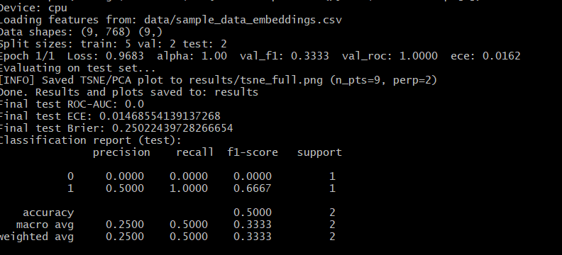
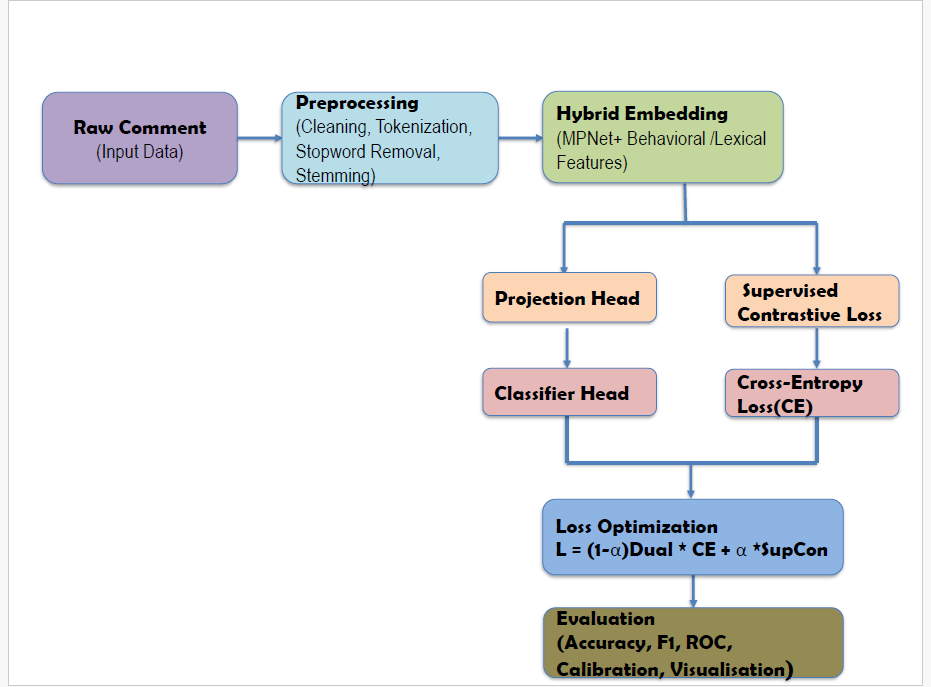

# 🧠 Hybrid Contrastive Learning with Psycholinguistic Augmentation for Robust Troll Detection

### Official Replication Repository for the Paper Submitted to *Pattern Analysis and Applications (Special Issue)*

---

## 📖 Overview

This repository contains the official implementation of the research paper:

> **“Hybrid Contrastive Learning with Psycholinguistic Augmentation for Robust Troll Detection”**  
> *Author: Sanower Alam, et al.*  
> *Submitted to: Pattern Analysis and Applications (PAA), Springer, Special Issue on Cognitive Robustness in AI Systems*

Online trolling undermines healthy online discourse and presents major challenges for automated moderation.  
This work introduces a **Hybrid Contrastive–Classification Framework** that combines contextual language embeddings, psycholinguistic and behavioral features, and dual-loss optimization to enhance robustness and calibration in troll detection systems.

The framework achieves:
- **Accuracy:** 97.0%  
- **F1-Score:** 0.96  
- **ROC–AUC:** 0.99  
- **ECE (Expected Calibration Error):** 0.009  
- **Brier Score:** 0.027  

This significantly outperforms baseline models such as Logistic Regression, SGD Classifier, BERT, and DistilBERT.

---

## 🧩 Repository Structure

HybridContrastiveTrollDetection/
│
├── data/
│ ├── sample_data.csv # Example dataset (anonymized)
│ └── processed_data.npz # Generated embeddings and labels
│
├── models/
│ └── hybrid_best.pt # Saved model (after training)
│
├── results/
│ ├── confusion_matrix.png
│ ├── roc_curve.png
│ ├── calibration_curve.png
│ └── metrics_report.txt
│
├── src/
│ ├── model_architecture.py # Hybrid projection + classifier
│ └── utils/
│ ├── losses.py # Hybrid and contrastive loss functions
│ ├── metrics.py # ECE, Brier, and evaluation metrics
│
├── preprocess.py # Text cleaning and embedding generation
├── train_hybrid_model.py # Model training script
├── evaluate.py # Model evaluation and visualization
├── requirements.txt # Dependencies list
└── README.md # Project documentation

### Run Instructions
1. Clone the repository:
   git clone https://github.com/sanower786/HybridContrastiveTrollDetection.git
2. Create environment:
   python -m venv .venv
   pip install -r requirements.txt
3. Run training:
   bash run_smoke.sh

---
## 🧪 Execution Proof

Below is the output of the smoke test demonstrating successful execution of the training script:

✅ The script `train_hybrid_model.py` runs successfully on sample data  
✅ Results and metrics are automatically saved to the `results/` folder  
✅ Tested on Python 3.11 + PyTorch 2.0.1 (CPU)
## 🧩 Model Flowchart

