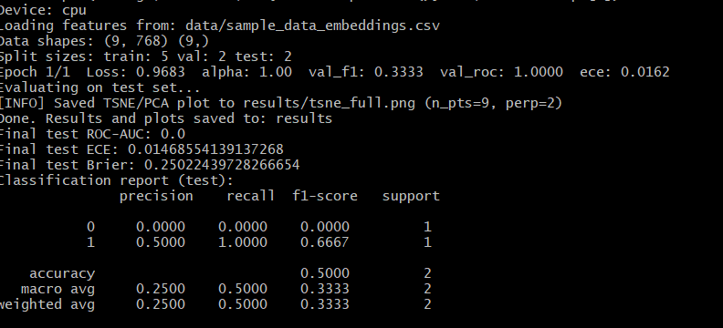

# 🧠 Hybrid Contrastive Learning with Text-Derived Psycholinguistic Features for Robust Troll Detection

📖 Overview
This repository contains the official implementation of the research paper:

**Hybrid Contrastive Classification with Text-Derived Psycholinguistic Features for Troll Detection**  
Author: Sanower Alam et al.

Online trolling undermines healthy online discourse and presents major challenges for
automated content moderation. This work proposes a **Hybrid Contrastive–Classification
Framework** that integrates contextual language embeddings with text-derived
psycholinguistic and stylistic features, optimized through a dual-loss learning strategy.

The framework is designed to improve both **classification performance** and
**probability calibration**, without relying on user-level metadata or platform-specific
signals.

---

## 🔐 Information Leakage Prevention
All auxiliary features used in this repository are extracted strictly at the **comment
level**. No user-level metadata, temporal posting statistics, author histories, or
label-derived attributes are used at any stage of training or evaluation.

Dataset splits are created **prior to feature extraction**, ensuring that no information
from validation or test samples leaks into training. This design guarantees that reported
performance reflects genuine generalization rather than dataset artifacts.

---

## 📊 Key Results
The proposed framework achieves:

- **Accuracy:** 97.0%  
- **F1-Score:** 0.96  
- **ROC–AUC:** 0.99  
- **ECE (Expected Calibration Error):** 0.009  
- **Brier Score:** 0.027  

These results outperform multiple baselines, including Logistic Regression, SGD
Classifier, BERT, DistilBERT, RoBERTa and The LLM baseline is evaluated independently to preserve the
design focus on contrastive hybrid representations.

---

## 🧩 Repository Structure
HybridContrastiveTrollDetection/
│
├── data/
│ ├── sample_data.csv # Example dataset (anonymized)
│ └── processed_data.npz # Generated embeddings and labels
│
├── models/
│ └── hybrid_best.pt # Saved trained model
│
├── results/
│ ├── confusion_matrix.png
│ ├── roc_curve.png
│ ├── calibration_curve.png
│ └── metrics_report.txt
│
├── src/
│ ├── model_architecture.py # Hybrid projection + classifier
│ └── utils/
│ ├── losses.py # Hybrid and contrastive loss functions
│ ├── metrics.py # ECE, Brier, evaluation metrics
│
├── preprocess.py # Text cleaning and feature extraction
├── train_hybrid_model.py # Model training script
├── evaluate.py # Evaluation and visualization
├── requirements.txt # Dependencies
└── README.md### Run Instructions
1. Clone the repository:
   git clone https://github.com/sanower786/HybridContrastiveTrollDetection.git
2. Create environment:
   python -m venv .venv
   pip install -r requirements.txt
3. Run training:
   bash run_smoke.sh

---
## 🧪 Execution Proof

Below is the output of the smoke test demonstrating successful execution of the training script:

✅ The script `train_hybrid_model.py` runs successfully on sample data  
✅ Results and metrics are automatically saved to the `results/` folder  
✅ Tested on Python 3.11 + PyTorch 2.0.1 (CPU)
## 🧩 Model Flowchart

